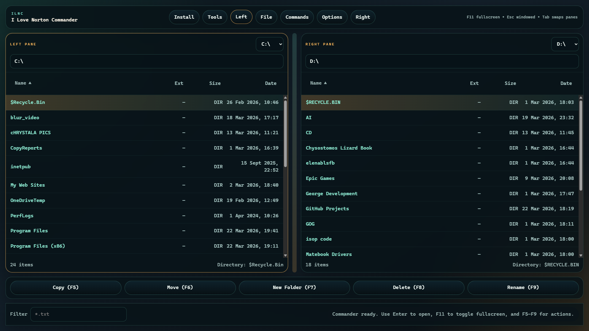

# I Love Norton Commander

A Tauri desktop app that recreates the dual-pane file-manager feel of Norton Commander with a modern TypeScript frontend and native filesystem commands.



## Docs

- [How the app works](docs/how-it-works.md)
- [UI overview screenshot](docs/graphics/commander-overview.png)

## Current Features

- Borderless fullscreen shell on launch so the app can take over the screen instead of looking like a standard Windows window
- Dual-pane directory browsing with drive selection
- Keyboard-first navigation with `Tab`, `Enter`, `Backspace`, and `F5` through `F9`
- `F11` toggles fullscreen mode and `Esc` drops back to a normal maximized window
- `Enter` launches Windows executables such as `.exe`, `.bat`, `.cmd`, `.com`, and `.msi`
- Sorting by name, extension, size, or modified date
- File and folder operations: copy, move, rename, delete, and create directory
- Tools modal for quick actions like swapping panes, revealing selections, and copying paths
- Install modal with local setup and build guidance for the Tauri toolchain
- Windows NSIS installer with automatic WebView2 bootstrap when the runtime is missing

## Local Setup

1. Install Node.js and npm.
2. Install Rust so `cargo` is available in your shell.
3. On Windows, install the Visual Studio C++ build tools required by Tauri.

Then run:

```sh
npm install
npm run check
npm run tauri dev
```

To build distributables:

```sh
npm run tauri build
```

The Windows bundle is configured to generate an NSIS installer and automatically install the WebView2 runtime when needed.

## Notes

- The frontend can be type-checked with `npm run check`.
- Native Tauri builds require a working Rust toolchain and platform prerequisites.
