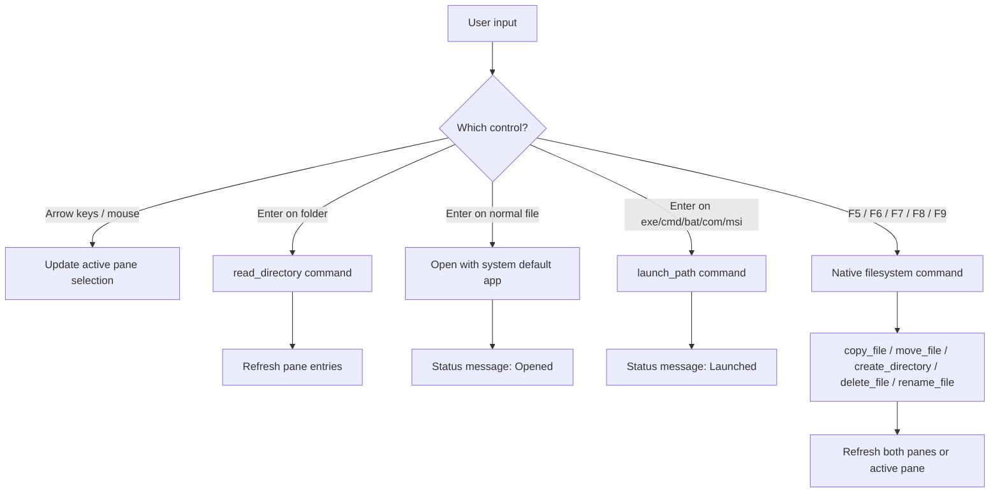
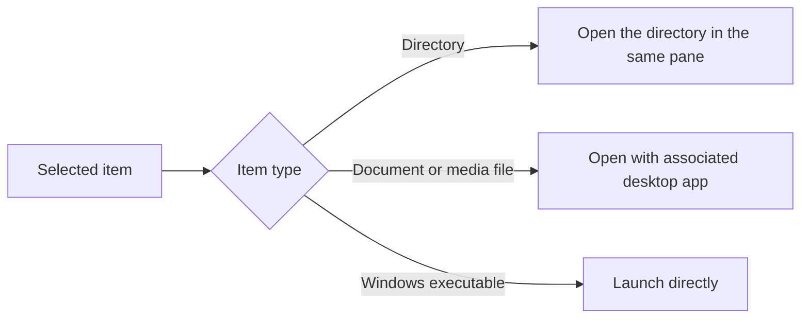

# How I Love Norton Commander Works

This guide explains what the app does today, how the two-pane workflow behaves, and what happens when you open, launch, copy, move, rename, or delete items.

## What You See

- The menu bar is the top control strip for Install, Tools, File actions, and command help.
- The left and right panes each track their own current directory, sort order, selection, and drive.
- The divider keeps the commander-style "active pane vs target pane" model clear.
- The command bar maps the classic file-manager actions to `F5` through `F9`.
- The filter box narrows both panes with wildcard patterns like `*.txt`.
- The status bar reports what the app just did, what it is loading, or why an action failed.

## Command Flow

## Pane Model

Each pane behaves like its own mini file browser:

- It loads a directory from the native Rust backend.
- It sorts entries locally by name, extension, size, or modified date.
- It prepends a `..` parent-directory row when the current path has a parent.
- It preserves selection when possible after refreshes and file operations.
- It keeps the other pane available as the default destination for copy and move commands.

## What `Enter` Does

On Windows, `Enter` now explicitly launches these file types:

- `.exe`
- `.com`
- `.bat`
- `.cmd`
- `.msi`

That means the app treats launchable files like commands instead of only handing them to the generic file opener path.

## What the App Can Do

| Area | Current behavior |
| --- | --- |
| Browsing | Switch drives, move into folders, and move to parent folders |
| Selection | Use mouse, `Arrow Up`, `Arrow Down`, and `Tab` to control the active pane |
| Sorting | Toggle by name, extension, size, and modified date |
| Filtering | Apply wildcard filters like `*.rs`, `*.png`, or `README*` |
| File launching | Open regular files with the system default application |
| Executable launching | Run Windows executables directly with `Enter` |
| File operations | Copy, move, rename, delete, and create folders |
| Tools | Swap panes, refresh both panes, reveal items, copy paths, and open folders externally |
| Install help | Show setup commands and prerequisite guidance from inside the app |

## Keyboard Map

| Key | Action |
| --- | --- |
| `Tab` | Switch the active pane |
| `Arrow Up` / `Arrow Down` | Move selection |
| `Enter` | Open a folder, open a file, or launch an executable |
| `Backspace` | Go to the parent directory |
| `F1` | Open install help |
| `F2` | Open the tools menu |
| `F5` | Copy selected item |
| `F6` | Move selected item |
| `F7` | Create a folder |
| `F8` | Delete selected item |
| `F9` | Rename selected item |
| `Ctrl/Cmd + R` | Refresh both panes |

## Installer Behavior

The Windows packaging path is configured around an NSIS installer.

- The installer uses the same branded app icon as the desktop application.
- The installer places Start Menu shortcuts under `I Love Norton Commander`.
- The installer is set to current-user mode by default.
- The installer bootstraps the WebView2 runtime automatically when it is missing.
- Downgrades are blocked so older versions do not install over newer ones by mistake.

## Native Backend Commands

The Rust side currently exposes these commands to the frontend:

- `read_directory`
- `get_drives`
- `copy_file`
- `move_file`
- `delete_file`
- `rename_file`
- `create_directory`
- `launch_path`

Those commands are what make the app feel like a real desktop file manager instead of a mock UI.
